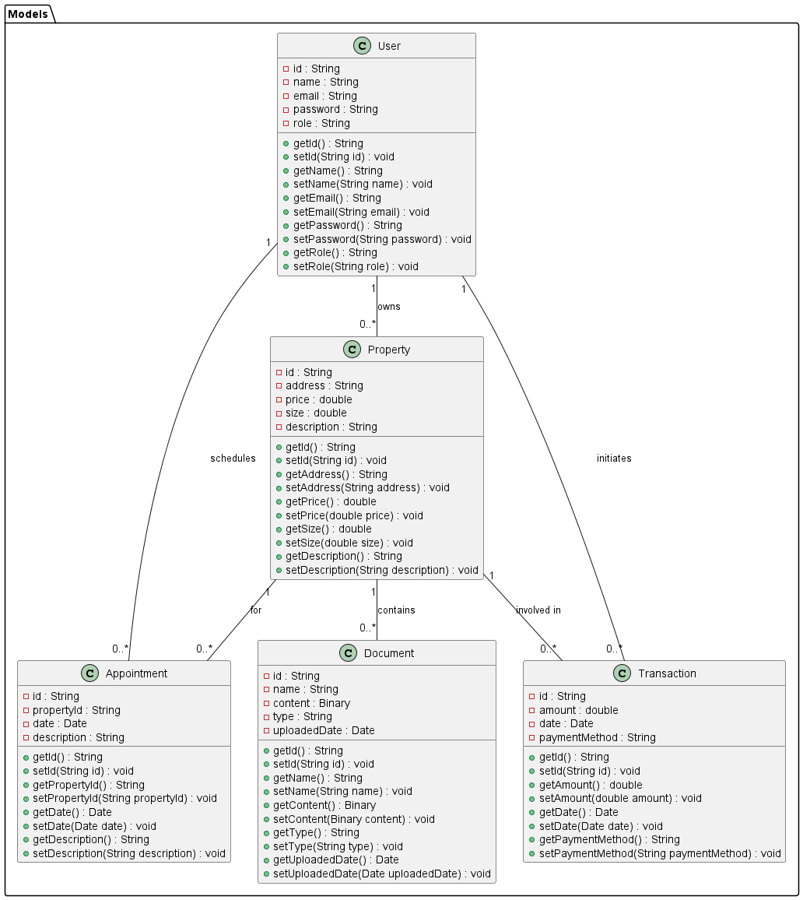
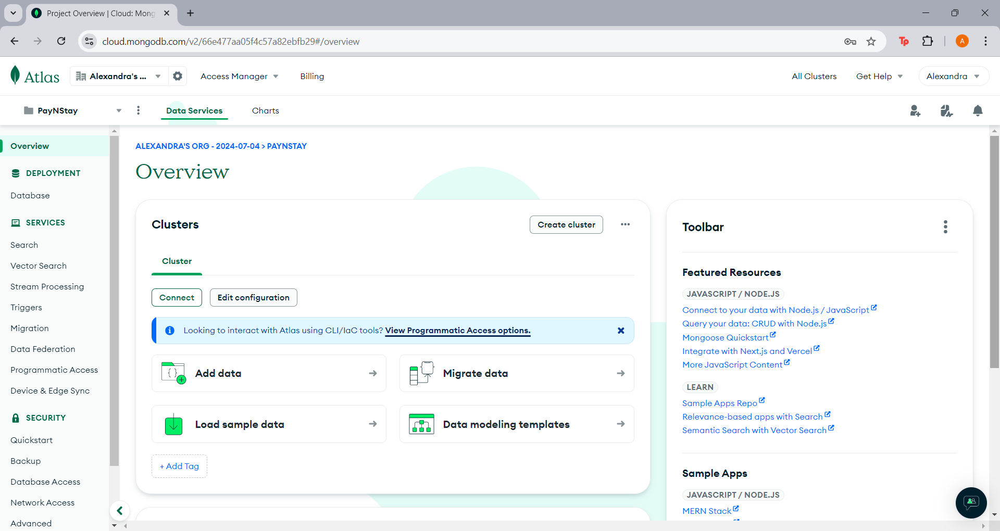
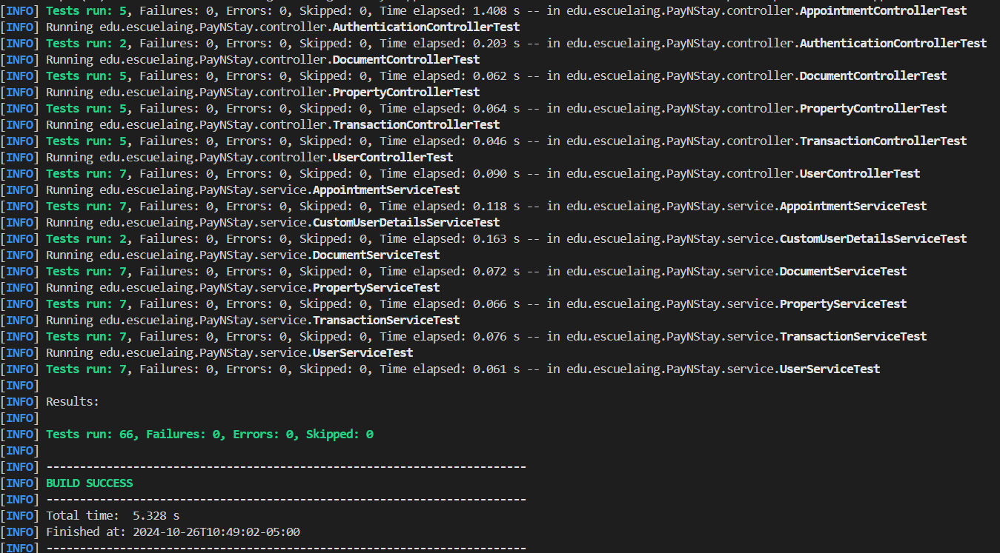

## PayNStay

This project implements a microservices architecture using Spring Boot and Docker. The platform offers a personalized experience with artificial intelligence for recommendations, predictive value analysis, and augmented reality to visualize changes in properties. The system provides services for appointments, document management, property listing, transactions, and user management, all stored in a MongoDB database.

## AI-Generated Visual Prototype

 - Logo
   
   

 - Home page
   
   

 - App

   


 - Properties description page

   


## Getting Started

These instructions will get you a copy of the project up and running on your local machine for development and testing purposes.

### Prerequisites

You need to install the following tools and configure their dependencies:

1. **Java** (versions 7 or 8)
    ```sh
    java -version
    ```
    Should return something like:
    ```sh
    java version "1.8.0"
    Java(TM) SE Runtime Environment (build 1.8.0-b132)
    Java HotSpot(TM) 64-Bit Server VM (build 25.0-b70, mixed mode)
    ```

2. **Maven**
    - Download Maven from [here](http://maven.apache.org/download.html)
    - Follow the installation instructions [here](http://maven.apache.org/download.html#Installation)

    Verify the installation:
    ```sh
    mvn -version
    ```
    Should return something like:
    ```sh
    Apache Maven 3.2.5 (12a6b3acb947671f09b81f49094c53f426d8cea1; 2014-12-14T12:29:23-05:00)
    Maven home: /Users/dnielben/Applications/apache-maven-3.2.5
    Java version: 1.8.0, vendor: Oracle Corporation
    Java home: /Library/Java/JavaVirtualMachines/jdk1.8.0.jdk/Contents/Home/jre
    Default locale: es_ES, platform encoding: UTF-8
    OS name: "mac os x", version: "10.10.1", arch: "x86_64", family: "mac"
    ```

3. **Git**
    - Install Git by following the instructions [here](http://git-scm.com/book/en/v2/Getting-Started-Installing-Git)

    Verify the installation:
    ```sh
    git --version
    ```
    Should return something like:
    ```sh
    git version 2.2.1
    ```

### Installing

1. Clone the repository and navigate into the project directory:
    ```sh
    git clone https://github.com/Richi025/PayNStay.git

    cd PayNStay
    ```

2. Build the project:
    ```sh
    mvn package
    ```

    Should display output similar to:
    ```sh
      [INFO] --- jar:3.3.0:jar (default-jar) @ Spark ---
      [INFO] The original artifact has been renamed to C:\Users\alexa\OneDrive\Escritorio\PayNStay\target\PayNStay-0.0.1-SNAPSHOT.jar.original
      [INFO] BUILD SUCCESS
    ```

3. Run the application:
    ```sh
    java -jar target/PayNStay-0.0.1-SNAPSHOT.jar edu.escuelaingPayNStayApplication

    ```

## Class Diagram



### Overview

The main classes in the system can be grouped into two key categories:

1. **Models**: These represent the core entities in the system, such as users, properties, appointments, and transactions.
2. **Repositories**: These provide an abstraction over MongoDB operations, allowing the system to interact with the database in a structured way.

### Detailed Class Breakdown

#### 1. `User`

- **Location**: `edu.escuelaing.PayNStay.Repository.User`
- **Description**: Represents a user entity.
- **Key Attributes**:
  - `id`: Unique identifier for the user.
  - `name`: Name of the user.
  - `email`: Email of the user.
  - `password`: Password for user authentication.
  - `role`: Defines the user's role (e.g., buyer, seller, admin).
- **Relationships**:
  - A user can own multiple properties.
  - A user can schedule multiple appointments.
  - A user can initiate multiple transactions.

#### 2. `Property`

- **Location**: `edu.escuelaing.PayNStay.Repository.Property`
- **Description**: Represents a property entity.
- **Key Attributes**:
  - `id`: Unique identifier for the property.
  - `address`: The physical location of the property.
  - `price`: The value of the property.
  - `size`: The size of the property (e.g., in square meters).
  - `description`: A textual description of the property.
- **Relationships**:
  - A property can have multiple appointments scheduled for viewing.
  - A property can be involved in multiple transactions.

#### 3. `Appointment`

- **Location**: `edu.escuelaing.PayNStay.Repository.Appointment`
- **Description**: Represents an appointment entity, where a user schedules a visit to a property.
- **Key Attributes**:
  - `id`: Unique identifier for the appointment.
  - `propertyId`: The property related to the appointment.
  - `date`: The scheduled date of the appointment.
  - `description`: Additional details regarding the appointment.
- **Relationships**:
  - Appointments are linked to users who schedule them.
  - Appointments are linked to the properties being viewed.

#### 4. `Transaction`

- **Location**: `edu.escuelaing.PayNStay.Repository.Transaction`
- **Description**: Represents a financial transaction related to a property.
- **Key Attributes**:
  - `id`: Unique identifier for the transaction.
  - `amount`: The financial value of the transaction.
  - `date`: The date when the transaction occurred.
  - `paymentMethod`: The method of payment (e.g., credit card, bank transfer).
- **Relationships**:
  - A transaction is initiated by a user.
  - A transaction is linked to the property being purchased or sold.

### Key Class Relationships

- **User**: Owns multiple properties, initiates transactions, and schedules appointments.
- **Property**: Can be involved in multiple transactions and viewed through multiple appointments.
- **Appointment**: Scheduled by users to view properties.
- **Transaction**: Conducted by users for properties.

## MongoDB Cluster

The MongoDB database used in this project is configured as a cluster for improved performance, redundancy, and scalability. This configuration ensures high availability of data and seamless handling of large amounts of property, transaction, and appointment information. The cluster configuration also allows the system to easily scale as the number of users and properties grows.


## Tests
Run the tests with the command:

```sh
mvn test
```
Result:


**Mockito:** is used to simulate the behavior of dependencies (such as PropertyService in the controller or PropertyRepository in the service) without interacting with the real database.

**JUnit:** is used to run the tests and verify the expected behaviors.

In these tests: 
- **Controller:** We simulate the calls to the service methods and verify that the responses are correct.
- **Service:** We simulate the database access through the Repositories and verify that the data is correctly persisted and retrieved.

## Test Report

### Author
Name: PayNStay

### Date
Date: 31/10/2024

### Summary

This report outlines the unit and integration tests conducted for the Property Management System. The tests ensure the reliability of CRUD (Create, Read, Update, Delete) operations for various entities, including `Appointment`, `Document`, `Property`, `Transaction`, and `User`. These tests cover both the `Controller` and `Service` layers to verify data validation, persistence, and retrieval functionality, as well as security measures such as token authentication and endpoint protection.

### Tests Conducted

#### Controller Tests

1. **Test `testCreateAppointment`**
   - **Description**: Ensures an appointment can be created with valid data.
   - **Objective**: Verify that `AppointmentController` can accept a POST request to create an appointment.
   - **Expected Behavior**: A new appointment is created and persisted with a unique ID.
   - **Verification**: Confirms response includes appointment details and that data is stored in the database.

2. **Test `testGetAllDocuments`**
   - **Description**: Retrieves a list of documents with pagination.
   - **Objective**: Validate that `DocumentController` can return a paginated document list.
   - **Expected Behavior**: Returns the correct number of documents with pagination metadata.
   - **Verification**: Checks the response content and pagination details.

3. **Test `testUpdateProperty`**
   - **Description**: Tests updating an existing property’s information.
   - **Objective**: Ensure that `PropertyController` allows properties to be updated and saved.
   - **Expected Behavior**: Property data is updated in the database and returned.
   - **Verification**: Confirms updated data matches the request and is persisted.

4. **Test `testDeleteTransaction`**
   - **Description**: Validates deletion of a transaction by ID.
   - **Objective**: Verify `TransactionController` can delete a transaction entry.
   - **Expected Behavior**: Transaction is removed from the database.
   - **Verification**: Confirms deletion by checking for absence in the database.

5. **Test `testGetUserById`**
   - **Description**: Retrieves a user by ID and verifies data integrity.
   - **Objective**: Ensure `UserController` can fetch user details.
   - **Expected Behavior**: Returns user data matching the provided ID.
   - **Verification**: Confirms returned user data and checks repository for consistency.

---

### Service Layer Tests

1. **Test `testGetAllProperties`**
   - **Description**: Retrieves a paginated list of properties.
   - **Objective**: Ensure `PropertyService` retrieves data with pagination support.
   - **Expected Behavior**: Returns the correct page with the expected properties.
   - **Verification**: Confirms pagination and content accuracy.

2. **Test `testGetAppointmentById`**
   - **Description**: Tests retrieval of a specific appointment.
   - **Objective**: Ensure `AppointmentService` fetches appointments by ID.
   - **Expected Behavior**: Returns the correct appointment details.
   - **Verification**: Checks ID and data accuracy.

3. **Test `testCreateDocument`**
   - **Description**: Tests document creation and persistence.
   - **Objective**: Verify `DocumentService` creates and saves documents.
   - **Expected Behavior**: Document data is stored and accessible.
   - **Verification**: Confirms repository interaction and data integrity.

4. **Test `testUpdateTransaction`**
   - **Description**: Ensures transaction data can be updated.
   - **Objective**: Validate that `TransactionService` updates records.
   - **Expected Behavior**: Updated transaction is saved and returned.
   - **Verification**: Confirms repository reflects changes.

5. **Test `testDeleteUser`**
   - **Description**: Verifies user deletion from the database.
   - **Objective**: Ensure `UserService` can remove users.
   - **Expected Behavior**: User data is deleted from repository.
   - **Verification**: Confirms absence of user after deletion.

---

### Security Tests

The system includes security-related tests to ensure endpoint protection and secure access:

1. **Token Authentication Validation**:
   - **Test**: Confirm that only authenticated requests can access protected endpoints.
   - **Objective**: Verify that endpoints are secured against unauthorized access.
   - **Expected Behavior**: Requests without valid tokens result in 401 Unauthorized status.

2. **CSRF Protection**:
   - **Test**: Ensure CSRF tokens are required for state-changing requests.
   - **Objective**: Protect endpoints from CSRF attacks.
   - **Expected Behavior**: Requests missing CSRF tokens return 403 Forbidden status.

---

## Test Coverage

- **Controller Layer**: Coverage includes all CRUD operations across key controllers (`Appointment`, `Document`, `Property`, `Transaction`, `User`), verifying endpoint functionality.
- **Service Layer**: Ensures business logic in `AppointmentService`, `DocumentService`, `PropertyService`, `TransactionService`, and `UserService` works as intended, with repository interactions validated.
- **Security Layer**: Confirms CSRF protection and token authentication are enforced for relevant endpoints, protecting the application against unauthorized access.


## Built With

* [Maven](https://maven.apache.org/) - Dependency Management
* [Git](http://git-scm.com/) - Version Control System
* [MongoDB](https://www.mongodb.com) - NoSQL database.

## Versioning

I use [GitHub](https://github.com/) for versioning. For the versions available, see the [tags on this repository](https://github.com/Richi025/PayNStay.git).

## Authors

* **Erika Juliana Castro Romero** - [Juc28](https://github.com/Juc28)
* **Alexandra Cortes Tovar** - [alexandrac1420](https://github.com/alexandrac1420)
* **Mariana Pulido Moreno** - [MPulidoM](https://github.com/MPulidoM)
* **José Ricardo Vásquez Vega** - [Richi025](https://github.com/Richi025)
* **Juan Sebastián Vásquez Vega** - [Sebasvasquezz](https://github.com/Sebasvasquezz)

## License

This project is licensed under the GNU.
